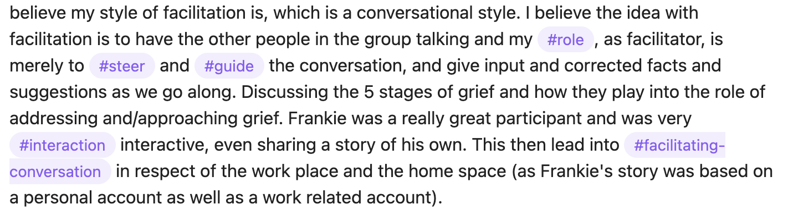
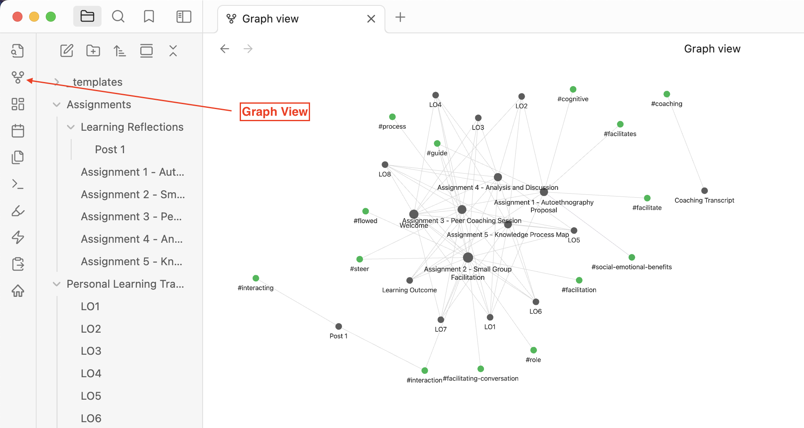

# Assessment {.unnumbered}

<!--//todo #12 -->

::: {.callout-note}
Assignments should be delivered by your normal bedtime in your timezone.
:::

| Assessment Task | Outcomes | Deliverable Dates | 
| --- | :---: | :---: |
| Learning Reflections | 1-8 | Throughout |
|Assignment 1 - Autoethnography Proposal | 1, 2, 8  | Aug 3 |
| Assignment 2 - Small Group Facilitation | 1, 3, 4, 5, 6, 7, 8  | Aug 10 |
| Assignment 3 - Peer Coaching Session | 1, 3, 4, 5, 6, 7, 8  | Aug 17 |
| Assignment 4 - Analysis and Discussion  | 1-8  | Aug 31 |
| Assignment 5 - Knowledge Process Map | 1, 2, 4, 5, 7, 8  |  Sep 15 |

<!-- 1.	Demonstrate the ability to model metacognitive strategies for self-regulated learning;
2.	Apply information and media literacies to research, produce, analyse and present information online.
3.	Design cognitive and social learning activities to meet learning outcomes.
4.	Evaluate interactions in a learning environment and develop strategies for high quality educative interactions;
5.	Evaluate the quality of feedback in light of evidence- based research
6.	Apply intercultural competencies in coaching learners in transformational blended learning environments;
7.	Analyze the characteristics of the coaching and facilitation roles within emerging multi- access models of blended teaching and learning;
8.	Apply multi-modal communication and collaboration tools effectively to support learning in a higher education context.
- Relevant throughout the course learning outcomes and activities and met through personal reflection on your personal faith journey. -->

<!--
| Assessment Task | Due Date | Approximate weight |
| --- | :---: | :---: |
| Learning Reflection Blogs | Ongoing, weekly | Required but not assessed |
| Facilitated Curriculum Analysis | Sept 23 | 10% |
| Small Group Facilitation | Sept 30 | 10% |
| Peer Coaching Session | Oct 14 | 15% |
| Showcase Post (choose one of your learning reflection blog posts to expand and elaborate) | Nov 4| 25% |
| Facilitation Resource Project | Nov 8 | 40% |
 {target="_blank"}
-->

## Learning Pods {.unnumbered}

At the beginning of the course everyone will be placed into small groups called learning pods. These groups, of about four people, will be the place where you will practice learning facilitation and coaching principles and skills that you are learning in this course. Your learning pods will be your first line of support through the course.

## Learning Reflections  {.unnumbered}

<!--
Throughout this course, you will be invited to write five “working” posts about what you are learning in this course. These posts will be published on your own WordPress blog which you will create in Unit 1 (if you don't already have one). You should consider your posts as a place for you to try out new ideas, to test your assumptions, and to share what you are learning with your community. At the end of the course you will produce a *Showcase Post*, which will represent your best work. The showcase post will be the only graded post; however, your final grade will also consider how your ideas developed over the process of you writing five working draft posts.
-->

Throughout this course, you will be invited to write four reflections about what you are learning in this course. You should consider your posts as a place for you to try out new ideas, to test your assumptions, and to share what you are learning with your community. You will use these posts as data in your analysis and synthesis tasks, so it is in your best interest to be thorough in your reflections ([use the W3 process if you’d like a structure, but focus on the ’WHAT?’](https://www.liberatingstructures.com/9-what-so-what-now-what-w/)), and make sure that you demonstrate **evaluative judgement**, or your ability to judge the quality of your own work, in relation to the relevant learning outcomes. Ensure that your post is a reflection of your coaching or facilitation experiences through the lens of the literature you reviewed and your personal coaching and facilitation context. Aim for 300-500 words.

Compose each post as a new topic in [the Learning Community](https://twu.discourse.group/c/leadership-463-663/21). Make sure you use tags in your post to allow you and others in the course to curate your thoughts.

### Reflection 1: Anderson’s Interaction Theorem {-}

#### Due at the end of Unit 1 {.unnumbered}

#### Topic {.unnumbered}
 
**Read** [Getting the mix right again: An updated and theoretical rationale for interaction](https://www.irrodl.org/index.php/irrodl/article/view/149/230) by Terry Anderson.  
**Read** [Interaction and the online distance classroom: Do instructional methods effect the quality of interaction?](https://rdcu.be/cKSGf)  by Heather Kanuka.  

Then, post a reponse on your blog defending or criticizing Anderson's Interaction Equivalency Theorem.  Ensure that you defend or criticize the idea, not the person, and include something that you have learned about interaction from somewhere other than the assigned readings.

If your birthday is between January 1 and June 30, **defend** Anderson's Interaction Equivalency Theorem.

If your birthday is between July 1 and December 31, **criticize** Anderson's Interaction Equivalency Theorem

Feel free to respond to arguments presented by your colleagues for or against the theorem.

Compose each post as a new topic in [the Learning Community](https://twu.discourse.group/c/leadership-463-663/21). Make sure you use tags in your post to allow you and others in the course to curate your thoughts.

### Reflection 2: Create an Abstract {.unnumbered}

#### Due at the end of Unit 3 {-}

Your second post will be based on your Autoethnography proposal (Assignment 1). Your task will be to create an abstract for your paper, which at this point, will be a summary of your proposal. Your abstract MUST be between 150 and 200 words. This is the standard word count for an article abstract in many journals. Do NOT include references, citations, or headings. Discuss your abstracts with your learning pods and provide critical feedback to each other as you complete this post.

Compose each post as a new topic in [the Learning Community](https://twu.discourse.group/c/leadership-463-663/21). Make sure you use tags in your post to allow you and others in the course to curate your thoughts.

### Reflection 3: Higher Education Trends {.unnumbered}

#### Due at the end of Unit 4 {.unnumbered}

Throughout this unit we have explored the idea of the educational experience. Your task for this post is to reflect on recent trends in higher adult education in terms of the multitude of new ways institutions are offering access educational experiences and how technology and assessment practices influence those experiences. You can use one or more of the following questions to guide your writing:

- How does technology impact the educational experience? Be specific with examples from your own experience.
- In what ways does assessment need to change to meet the challenges of modern higher education?
- How can educational institutions give learners more control over their learning experiences?  
- What benefits and challenges does learner-centred access to education introduce?  
- Is the recent move towards multi-access education shifting the site of education back to an emphasis on study and away from the focus on instruction that dominated the modern era?  
- How might this shift change the educator’s role and responsibilities?  
- How might this shift change the learner’s role and responsibilities change?  
- How can institutions ensure quality and transformational learning outcomes?  

Compose each post as a new topic in [the Learning Community](https://twu.discourse.group/c/leadership-463-663/21). Make sure you use tags in your post to allow you and others in the course to curate your thoughts.
<!--
#### Topic {.unnumbered}

In your Discussion Post for this unit, you are being asked to select one core coaching competencies identified in this unit and reflect on how you might apply it in an educational setting. You can use the following questions to guide your writing:

- How would you define the coaching competency?   
- Why is the competency important?    
- What set of integrated knowledge, skills, aptitudes and attributes help define, in more detail, how to successfully perform the job to be done?    

Compose each post as a new topic in [the Learning Community](https://twu.discourse.group/c/leadership-463-663/21). Make sure you use tags in your post to allow you and others in the course to curate your thoughts.

### Post 4{.unnumbered}

#### Due at the end of Unit 4 {.unnumbered}

- In a new post, [complete the Visitors and Residents in online spaces Learning Activity](https://ma-lead.github.io/ldrs663/building-the-web.html#learning-activity). What do you notice about your map? What do you wonder?  

To submit all of your posts for the course, create a new journal entry in your Obsidian vault.
-->

### Reflection 4: Assessment Experiences {.unnumbered}

#### Due at the end of unit 5 {.unnumbered}

Post 4 is a personal reflection on assessment and how it has impacted you as a learner. Use specific examples from your own experiece (your personal experience, or possibly a family member's experience) of what you think are helpful and unhelpful assessment practices and strategies. How have those experiences impacted your view of the validity and reliability of assessment in formal education?

Compose each post as a new topic in [the Learning Community](https://twu.discourse.group/c/leadership-463-663/21). Make sure you use tags in your post to allow you and others in the course to curate your thoughts.

## Assignment 1 - Autoethnography Proposal  {.unnumbered}

Your project throughout this course will be to engage in an autoethnographic exploration of your experiences learning about and practicing coaching and facilitation skills in the context of higher education. Each assignment in the course will contribute towards the creation of an autoethnographic account of your experiences in the course and the final result will be a document in the form of a scholarly article. The first component of this project is to create a proposal, which will include a brief introduction to your project, a literature review, and a description of your methods (autoethnography).

::: {.column-margin}
*Autoethnography is a form of ethnographic research in which a researcher connects personal experiences to wider cultural, political, and social meanings and understandings.*[Wikipedia](https://en.wikipedia.org/wiki/Autoethnography)
:::

Working individually and in cooperation with your learning pod, use the TWU library and AI-powered tools such as LitMaps to find 8-10 peer-reviewed articles on a topic of your choosing, but *related to coaching and/or facilitation*. Focus on finding at least one systematic or scoping review and several other topical papers. Import the citations and papers into Zotero and then Obsidian. On each file in Obsidian, summarize the associated article, and annotate the PDF. Export the references from Zotero as an .RIS file and include the file in your vault. Create a new Canvas in Obsidian and create a concept map of the relationships between the ideas in the papers. Include on your canvas a new file in which you summarize your concept map (300-500 words).

## Assignment 2 - Small Group Facilitation  {.unnumbered}

Working in your learning pods, you will each facilitate a short 10-15 min learning activity. In your learning pods, each of you should select a topic from LDRS 463/663 and guide your group through a review discussion of that topic. It is recommended that you use an activity modified from one of the [Liberating Structures activities](https://liberatingstructures.com). Following our meeting, you will have access to the recording of the session and you should re-watch your section and create a detailed reflection on the experience. Describe as much as you can in response to what happened in your session.

I hope you will push your comfort level in this activity, take some risks, and hopefully mess up. That will be a good thing because it will give you much to reflect on later.

Your reflection should be submitted as a 300-500 word 'Daily Note' in your Obsidian vault, named 'facilitation-reflection'.

In your facilitation session, demonstrate and reflect on the following:

-  preparing for the session (as evidenced by your composed materials to support learning in your session).  
-  creating a supportive environment (referring to participants by name, clarifying expectations, responding in an affirming way to others, and acting in and communicating in a respectful and supportive manner).  
-  managing the learning process (beginning and ending the session on time, fostering participation by all learners in the group, keeping the learning group on track, facilitating interaction within the learning group, and summarizing learning, calmly and creatively adapting to unexpected events).  
-  fostering learning (showing interest and enthusiasm, spending more time asking than telling, posing open-ended questions, waiting for learners to respond, seeking clarification, activating learners' prior knowledge effectively, using appropriate forms of engagement to stimulate learner involvement).

## Assignment 3 - Peer Coaching Session  {.unnumbered}

Working with another student (in your pod), you will each coach each other through the process of writing the final draft of your autoethnography assignment or another challenge you have encountered in the course. You will record a video of your session and write critical reflection on your actions as the learning coach.

- Working with another student, use the G.R.O.W. model to coach each other through the process of planning for a particular learning activity within this course (such as your autoethnography paper).
- There are two outcomes to assessment:
  - you will produce a Teams recording of your coaching session, and
  - you will write a 1-2 page reflection on your actions coaching your peer’s learning.

## Assignment 4 - Data Analysis and Discussion

Using your learning reflections, your experiences as coaches and facilitators in this course or outside of it, your concept map and literature review as your foundation, answer the [‘SO WHAT?’ portion of the W3 process](https://www.liberatingstructures.com/9-what-so-what-now-what-w/). You might want to use a general qualitative coding procedure to help understand your data. I also encourage you to assist your peers by coding their posts. This phase of your project should result in a clear and rich picture of your coaching and facilitation experiences. Quote liberally from your learning reflections. It is critical in this phase to be clear about what sense you make from your data. You are answering the question ‘What does this all mean for me?’  

In the final phase, you will work closely with your learning pod to answer the[ ‘NOW WHAT?’ ](https://www.liberatingstructures.com/9-what-so-what-now-what-w/)question. Looking forward to your life and career or vocation, how will your new knowledge impact your way of being in the world? How could your new knowledge impact others’ ways of being in the world in relation to coaching and facilitation? What are the implications of your analysis. Be sure to express that your conclusions are not generalizable. The result of this phase will be a cohesive paper following the tradition of (collaborative) autoethnography. 

### Steps to complete assignment 4

::: {.callout-note}
The process to complete Assignment 4 will also complete Assignment 5.
:::

#### Gather Data
- Gather all the data that you have generated during the activities of the course. Data sources include
  -  all four posts from your reflective journal,
  -  assignment 1 (Autoethnography proposal)
  -  assignment 2 (Facilitation Reflections)
  -  assignment 3 (Coaching Reflections)
  -  text transcripts from your facilitation and coaching sessions (if these are not available, include the feedback notes you received from me). You can export the transcripts to .docx from the recording page.
-  Copy the text from each of those files into separate files in your obsidian vault.

#### Code or Tag your Data

-  Once you have everything in your vault, you can start coding your work using `#tags`. To create a tag, simply add a `#` to the beginning of a word, so your vault will look something like this:

- each tag should represent a theme present in your reflections. Themes will likely include things like facilitation, coaching, coach, facilitator, GROW (and each component), EFFECT (and each component), interaction, and keywords from the course learning outcomes. If you find that your reflections were too sparse, you may need to write more, and that is fine.
- you should look for both 'mentions' of course topics as well as 'examples' of you demonstrating coaching and facilitation skills.

#### View the Graph in Obsidian

- once you have a deep network of tags in your data, you can view the Graph in Obsidian. To do this, click the `Open graph view` button in the menu on the left side of the Obsidian window.

Here is a quick video demonstration:

<iframe src="https://mytwu.sharepoint.com/sites/LearningDesign/_layouts/15/embed.aspx?UniqueId=bcf08012-6248-4dd0-b3a5-5b743ef574ef&embed=%7B%22ust%22%3Atrue%2C%22hv%22%3A%22CopyEmbedCode%22%7D&referrer=StreamWebApp&referrerScenario=EmbedDialog.Create" width="640" height="360" frameborder="0" scrolling="no" allowfullscreen title="Obsidian - Tags and Graph View.webm" style="border:none; position: absolute; top: 0; left: 0; right: 0; bottom: 0; height: 100%; max-width: 100%;"></iframe>

Tagging and viewing your graph should be an iterative process as you try to make sense of what you have learned in the course.

#### Write!

Use all of your data as listed above, plus the tags you create, and the patterns you see in your graph to reflect on what you can learn about coaching and facilitation, and apply these lessons to the situation you highlighted in your autoethnography proposal. Your final paper should include the following sections:

- Introduction (from your proposal)
- Literature Review (from your proposal)
- Methods (description of autoethnography from your proposal and how you gathered and analysed your data)
- Data Analysis and Discussion (include discussion of the graph view of your Obsidian vault)
- Conclusion

Your entire paper should be 2000-2500 words in length, plus references.

## Assignment 5 - Knowledge Process Map

::: {.callout-important}
Your Knowledge Process Map is the graph view of your Obsidian vault as created in Assignment 4. Submit Assignment 4 and 5 along with your entire vault as a compressed folder in Moodle.
:::

## TWU Grading Scale

The [TWU Grading Scale](https://www.twu.ca/about/policies-guidelines/university-standard-grading-system), available on the syllabus for this course, describes A-, A, or A+ work as

> **Outstanding, excellent work**; exceptional performance with strong evidence of original thinking, good organization, meticulous concern for documented evidence, and obvious capacity to analyze, synthesize, evaluate, discern, justify, and elaborate; frequent evidence of both verbal eloquence and perceptive insight in written expression; excellent problem-solving ability in scientific or mathematical contexts with virtually no computational errors; demonstrated masterful grasp of subject matter and its implications. Gives evidence of an extensive and detailed knowledge base. (Note: The A+ grade is reserved for very rare students of exceptional intellectual prowess and accomplishment, especially in lower level courses.)

For a grade in the B-, B, or B+ range, here is what you need to do:

> **Good, competent work**; laudable performance with evidence of some original thinking, careful organization; satisfactory critical and analytical capacity; reasonably error-free expository written expression, with clear, focused thesis and well-supported, documented, relevant arguments; good problem-solving ability, with few computational or conceptual errors in scientific subjects; reasonably good grasp of subject matter but an occasional lack of depth of discernment; evidence of reasonable familiarity with course subject matter, both concepts and key issues. Exhibits a serious, responsible engagement with the course content.

We are happy to have a conversation with you if you feel your work has been unfairly assessed and you can provide a justifiable rationale based on the product of your work in relation to the requirements of the assignment and the standards outlined above and in the University Calendar.
