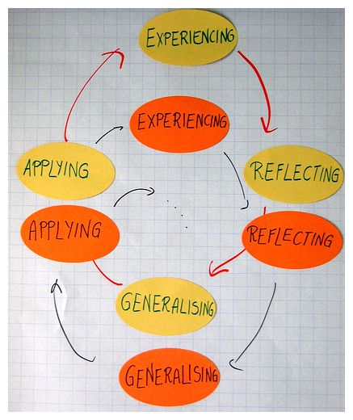
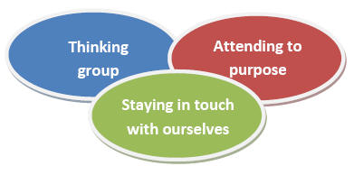

# Facilitating learning and change in groups and group sessions

Facilitating learning and change in groups and group sessions. Just what is facilitation, and what does it involve? We explore the theory and practice of facilitation, and some key issues around facilitating group sessions.

The idea that helpers and educators are facilitators of learning and change has been around at least since the 1960s. It was the work of Carl Rogers in the United States and Josephine Klein (1961) in Britain that brought the idea to the fore. However, the significance of facilitation and facilitators had already been recognized by some commentators on organizational life. Groups were becoming understood as the basic work unit of organizations – being used to plan and implement change, and to organize work. It followed that interventions facilitating effectiveness – and reducing conflict – were fundamental to the interests of organizations.

‘Facilitation’ and ‘facilitating’ gained ground in adult education, community education, youth work and informal education in part because educators and animateurs are ‘usually at pains to contrast the emotionally congenial aspect of their practice with what they regard as the rigid and conformist nature of schooling’ (Brookfield 1986: 123). However, with a greater emphasis on learning as against teaching within formal education, the use of the terms ‘facilitator’, ‘facilitating’ and ‘facilitation’ appears to have grown.

In this piece we will look at the nature of group facilitation, the values involved and the role of facilitators. We will also examine some of the practical tasks and experiences of facilitating group sessions. In particular we explore beginning a session; getting into the subject; responding to the moment; summing up and ending; and how facilitators deal with difficult behaviour.

## What is group facilitation?

At heart facilitation is about the process of helping people to explore, learn and change.

But what does facilitating involve? To start I want to take a popular definition of group facilitation by Roger Schwarz.

> Group facilitation is a process in which a person whose selection is acceptable to all members of the group, who is substantively neutral, and who has no substantive decision-making authority diagnoses and intervenes to help a group improve how it identifies and solves problems and makes decisions, to increase the group’s effectiveness.
> The facilitator’s main task is to help the group increase effectiveness by improving its process and structure. (Schwarz 2002: 5)

Roger Schwarz has made a number of important points here. First, there is a sense in which facilitators have to stand apart from groups yet be acceptable to them. They have to be seen as a third party. Ideally facilitators should not be members of the groups or their leaders as this can cause confusion around the role being played (Schwarz 2002: 42).

Second, for things to work group members have to allow facilitators to facilitate. At the same time facilitators need to earn the space to do this. Facilitators achieve this by doing their job well, and as Roger Schwarz points out by being neutral – not taking sides. This is not at all easy. To work facilitators have to intervene. Facilitating involves making suggestions and offer insights. Such intervention may well be seen by some in a group as favouring one side or another. Facilitating and remaining neutral, ‘requires listening to members’ views, and remaining curious about how their reasoning differs from others (and your private views), so that you can help the group engage in productive conversation’ (Schwarz 2002: 41).

Third, facilitators are not the decision-makers, nor mediators. It is difficult to facilitate sessions where you have what Schwarz talks about as ‘decision-making authority’. Knowing that the person who is the ‘facilitator’ can override any decisions that the group come to will seriously affect the way the members see their task and how they relate to the facilitator. Facilitators are not involved in the actual making of decisions (other than around their role and the process of the group); and in the purest form should avoid placing themselves in the middle of disputes – interpreting one to another. Their task is to work so that participants engage with each other directly (Schwarz 2002: 42)

Fourth, facilitators are experts on, and advocates of, process. While there may be times when facilitators teach – what we might describe as organized moments dedicated to encouraging particular learning (Smith and Smith 2008: 103) – most of our attention when facilitating is on encouraging reflection around experiences and process, the task or to other aspects of the group.

I now want to turn to a second definition of group facilitation – this time drawn from a more therapeutic tradition of practice.

> What I mean by a facilitator… is a person who has the role of empowering participants to learn in an experiential group. The facilitator will normally be appointed to this role by whatever organization is sponsoring the group. And the group members will voluntarily accept the facilitator in this role.
> By experiential group I mean one in which learning takes place through an active and aware involvement of the whole person – as a spiritually, energetically and physically endowed being encompassing feeling and emotion, intuition and imaging, reflection and discrimination, intention and action. (Heron 1999: 2)

Here we can see John Heron covering some of the same ground as Roger Schwarz – but he also highlights three further aspects with regard to facilitating groups that we need to consider.

First, the model employed is what we might describe as experiential learning. As such facilitating groups involves attention to learning that is achieved through reflection upon everyday experience or direct encounter ‘with the phenomena being studied rather than merely thinking about the encounter, or only considering the possibility of doing something about it.’ (Borzak 1981: 9 quoted in Brookfield 1983). In David A. Kolb’s classic model it has four elements: concrete experience, observation and reflection, the formation of abstract concepts and testing in new situations.

The workshop picture representing experiential learning is from the EFEO Action Workshops in 2008. It was taken by devilarts and is copyrighted. It is reproduced here under a Creative Commons licence (Attribution-Non-Commercial-Share Alike 2.0 Generic)

Second, the primary responsibility for learning lies with the group participant, the learner, only secondarily with the facilitator (Heron 1999: 2; see, also, Brookfield 1986). There is an emphasis upon self-direction. This is different to more traditional educational models where teachers are seen as having responsibility for student learning.

Last, and in contrast to some approaches to facilitation and facilitating , John Heron alerts us to the significance of working with the whole person. Facilitation in his view is a holistic intervention.

From all this we can see that facilitation – helping people to explore, learn and change – involves us in building a range of skills. Facilitating also, as Carl Rogers pointed out, requires us to develop certain qualities as people.

## Core conditions and the facilitator
Carl Rogers believed that people increasingly trust others when they feel at a deep level that their experiences are respected and understood (Thorne 1992: 26). Based on this he argued that there are three ‘core conditions’ for facilitative practice – realness, acceptance and empathy. Our success as educators, helpers and animators of learning and change is heavily dependent on the people we are – and the way we are experienced by others.

Let us look further at these qualities – these attitudes – that facilitate learning.

> Realness in the facilitator of learning. Perhaps the most basic of these essential attitudes is realness or genuineness. When the facilitator is a real person, being what she is, entering into a relationship with the learner without presenting a front or a façade, she is much more likely to be effective… It means coming into a direct personal encounter with the learner, meeting her on a person-to-person basis. It means that she is being herself, not denying herself.
> Prizing, acceptance, trust. There is another attitude that stands out in those who are successful in facilitating learning… I think of it as prizing the learner, prizing her feelings, her opinions, her person. It is a caring for the learner, but a non-possessive caring. It is an acceptance of this other individual as a separate person, having worth in her own right. It is a basic trust – a belief that this other person is somehow fundamentally trustworthy…
> Empathic understanding. A further element that establishes a climate for self-initiated experiential learning is emphatic understanding. When the teacher has the ability to understand the student’s reactions from the inside, has a sensitive awareness of the way the process of education and learning seems to the student, then again the likelihood of significant learning is increased…. [Students feel deeply appreciative] when they are simply understood – not evaluated, not judged, simply understood from their own point of view, not the teacher’s. (Rogers 1967 304-311)

Facilitators have to be experienced as genuine – real people that can be related to; they have to care for and respect people; and they need to develop some sense of what might be going on for others. In part they do this by coming to understand themselves.

## The facilitator’s role
Elsewhere we have discussed the three foci for group workers. Like group workers facilitators need to ‘think group’, attend to purpose, and stay in touch with themselves.

## Thinking group
‘Thinking group’ means focusing on the group as a whole – ‘considering everything that happens in terms of the group context (also the wider context in which it is embedded –social, political, organizational) because this is where meaning is manifest’ (McDermott 2002: 81-2). It also entails facilitating the strengthening of the group as, what Glassman and Kates (1990: 105); described as a ‘democratic mutual aid system’ (see also Mullender and Ward 1991; Shulman 1979: 109; 1999). The facilitator seeks to help groups to help themselves.

## Attending to purpose

Facilitators need to keep their eyes on the individual and collective goals that the group may or does want to work towards. Facilitating entails intervening in the group where appropriate to help people to clarify and achieve these.

## Attending to ourselves

Being a ‘good’ educator, helper or animator of community learning and development involves rather more than technique. It flows from our identity and integrity (Palmer 2000: 11). In the same way good facilitators know themselves and are able to draw upon their feelings to make sense of what might be going on with other people. If we do not know who we are then we cannot know those we work with, nor the areas we explore. Another concern here is knowing, and bearing in mind, the responsibilities that go along with our role when facilitating. Gail Evans (2007) argues that we must know what the agency expects of us, what the limits are, and what supports are available. She also says that we must be clear with ourselves about what we can offer in terms of our time, knowledge, skills and feelings.

## Core values

On what basis do we make choices about our practice? As facilitators we should be guided by certain commitments. On the one hand are found what we can call ‘core values’ – a set of beliefs that are shared and debated among the ‘community’ (community of practice) of facilitators. On the other, are our personal commitments and values.

We might expect that the values informing facilitation and facilitating would be close those running through education. We would be surprised if there wasn’t some concern with truth, or belief in respect for others. Writers on facilitation and facilitating groups inevitably put their own spin on what is required but the four core values that Roger Schwarz cites link to those articulated by many educationalists:

- **Valid information**. This means that participants share information in ways that allows others to understand their reasoning and, ideally, to make some judgements about whether the information is accurate (Schwarz 2002: 46). There also needs to be a commitment when facilitating groups to seeking new information in order to review and make decisions and develop understandings.
- **Free and informed choice.** Participants should be able to define their own objectives and methods for achieving them; choices should not be coerced or manipulated; and choices should be based on valid information. (Schwarz 2002: 47).
- **Internal commitment.** Participants feel personally responsible for the choices they make: they own their decisions. In addition commitment to action is ‘intrinsic, rather than based on reward or punishment’.
- **Compassion**. Participants need to be able to suspend judgement and allow themselves to be concerned about the experiences of others, and their suffering. They also need to be concerned with their own suffering and wellbeing.

The first three of these values are drawn from the work of Chris Argyris and Donald Schön, the last is his own.

I now want to turn to the process of planning sessions and structuring them. Here, rather pragmatically, I have looked to my own experiences as a facilitator and tried to link this in to the more holistic approach we have been discussing.

## Facilitating group sessions – having a plan

A lot of the business of groups is carried out without much overt thought. Things get done as part of the process of being together. However, there are times when more formal meetings are required to explore some question, make decisions or do business. Here we are describing these times as group sessions; periods when people are gathered together to learn and form judgements. We need to plan for these sorts of encounters. At the same time we also need to ensure that the session can change to address the needs of participants.

There are lots of ways of thinking about what it is important to attend to – but here I want to use a simple model: EFFECT. All it does this to remind us to think about:

- Environment. What sort of settings do we need to work with the group to facilitate so that people can engage with each other and the subject that is our focus?
- Focus.What is the purpose of the session? What is the subject of our learning and action? Does it relate to what people have expressed as needs, or that we have identified as needs?
- Feelings. What sense do people have of what they want and need? What emotions is the session likely to evoke or is evoking?
- Experiences. Does the session have the mix of experiences/activities to facilitate and stimulate exploration and learning, address the focus of the session, and meet the needs of participants? Are we facilitating the right sort of openings in the session for people to work together to explore and express these?
- Changes. In what ways would we like people to change, do participants want to change (and if so how). Are people changing – if at all – by participating in the session?
- Timings. Have we allocated the right amount of time for the different learning experiences and activities?

A few things need saying about this listing.

First, listings like this are always open to argument about what has been included, and what has been left out. This particular way of thinking about facilitating and planning sessions is based in an orientation that values what people bring to sessions, and about what can develop out of engaging with some subject or issue that has meaning to them. It isn’t based upon objectives set by the facilitator, or the ‘delivery’ of some package. For these reasons the session isn’t based around objectives – but rather looks to facilitating conversation and exploration – and the experiences that might help exploration and change.

Second, my concern here is to bring to the fore a concern is to facilitate an environment in which participants can ‘own’ the subject and the relationships in the group. Thus, for each of the elements we need to consider what both we – and the participants might want – and involve them in making decisions about the character and direction of the session. One of the implications of this is that we have to work at the pace of the group – and to respond to questions and issues as they arise. This might involve moving off the initial subject and returning to it.

Third, I have included ‘feelings’ here as some facilitators fail to address them properly even though they are a fundamental part of group process and learning. When facilitating we can become too focussed on the overt subject, or nervous of what acknowledging or talking about feelings can bring. Things can become unpredictable – and what we thought was the focus of the session shifted to emotional matters and relationships.

Fourth, there is always a significant danger of trying to cover too much ground in a session. The experience can quickly deteriorate into a quick tour of an area rather than an exploration. At the same time we may well be nervous about running out of material when facilitating a group. One way through this is to start with a fairly tight focus – but to have something in reserve in case things don’t take off.

Last, it is important to think about the basic structure of the session – what needs to be done when. It is to that we now turn.

Facilitating group sessions – beginnings, middles and endings
There has been a lot written about the different stages that groups and sessions go through – but in the end I have found that the most reliable way of thinking about what is going on is the most obvious. Sessions have beginnings, middles and ends – each with its own task. These are concerned with the 3e’s:

encouraging exploration,
engaging with the subject, and
enabling people to move on.
Gail Evans has suggested that within helping conversations (and for my money facilitating sessions) it is worth thinking in terms of the exploration as the first quarter of the session; engaging with the subject and developing understanding as the middle half; and enabling action and development as the final quarter (2007: 131). We will look at each in turn.

Beginnings – encouraging exploration
The first quarter or part of the session classically involves three tasks. These entail:

Establishing the focus of the session. Setting up the question or issue that we are going to explore.
Encouraging trust. Acting so that people are disposed to work together with the facilitator to create an environment in which all can participate.
Helping people to engage with the subject and each other. Here, when facilitating a group, we might pose some initial questions or open up conversations.
There is no set way of going about this – it changes with the focus of the session and the resources we have at our disposal. There are two rules of thumbs for facilitators and facilitating. The first is that whatever we choose to do needs to excite interest and commitment. The second is that we are looking to invite people into a conversation. If we follow these through then there are some obvious things for facilitators to avoid. These include starting with a PowerPoint presentation of the session’s learning objectives; using icebreakers and trust games (there is nothing like a ‘trust game’ to stimulate doubts as to whether the other group members can be trusted); and appearing to be unprepared or unclear (‘So what shall we talk about today?).

Some classic beginnings facilitators use include establishing the focus by using a short video clip – perhaps from YouTube; stating the focus and encouraging exploration by asking people to work on some aspect of it in twos, threes or small groups; working with some of the participants beforehand so that they set the scene by making a short presentation; and summarizing where the group had got to in the previous session (if there was one).

Middles – engaging with the subject and developing understanding
The middle half of the session involves facilitating a deepening of the exploration so that people gain a better understanding of the issue or question – and how it might relate to them.

When thinking about what might be involved in this middle half it is worth going back to what we discussed earlier in relation to Heron’s work. The form of learning mostly associated with facilitators and facilitating is experiential. There may well be times when it is necessary for us as facilitators to make a more formal presentation or input as a way of deepening exploration. Mostly though, we either need to encourage people to reflect and build new understandings. As a starter we might ask people to:

Take part in an activity that may highlight or dramatize the questions and issues we are exploring. Examples here facilitating role play and simulation, using extracts from programmes, films or videos, case studies, and other group activities.
Return to some previous experience – for example looking at something that happened in their work.
Such reflection is an activity in which people ‘recapture their experience, think about it, mull it over and evaluate it’ (Boud, Keogh and Walker 1985: 19). It can be seen as having three aspects:

Returning to experience – that is to say recalling or detailing relevant events.
Attending to (or connecting with) feelings – this had two aspects: using helpful feelings and removing or containing obstructive ones.
Evaluating experience – this involves re-examining experience in the light of we trying to do and our existing knowledge etc. It also involves integrating this new knowledge into our thinking. (ibid: 26-31)
As facilitators we might ask questions, summarize what has been said or we have seen going in the group; or make observations or comments to help people to address the different aspects of reflection. We might, when facilitating groups, say relatively little. Much of the job of facilitation is done by our presence in the group rather than our being the centre of activity. If we are able to communicate realness, a care and respect for the group, and empathy by the way we conduct ourselves then this can rub off on others. It can help to build an environment in which feelings can be expressed and work done.

When exploring tensions in the group, sensitive questions, or issues where people have strong feelings it is worth bearing in mind that a key task for facilitators is containment. Our job when facilitating is to work with the group to make sessions safe places for dialogue and exploration. At the same time we also need to be encouraging honesty and challenge (Palmer 1998). Too much intervention and we can quickly be seen as taking sides or as closing down debate; too little causes a vacuum and can make the situation feel unsafe.

Endings – enabling people to move on
The final quarter or part of the session is concerned with helping people to make an assessment of their understanding of the issue, task or question that was the focus of the session for them and what, if any, action they need to take individually or as a group. It is also about facilitating the closure of the session. Together these allow people to move on.

The key tasks entail enabling people to:

Take stock. As facilitators we need to help people to take stock of where they have got to. We might do this as a whole group activity, or ask people to work individually, in pairs or in small groups.
Identify any goals – and what they need to commit to, and do, to achieve them. There may be things for the group to do as a whole, for individuals to do on behalf of the group, and for individuals for their own situation. One of the key tasks of facilitators and facilitating is to help people with, as Gerard Egan (2002, 2006) has put it, the ‘commitment process’. This first entails helping people to use their imaginations to spell out possibilities for a better future -asking people what they want and need and discovering some of the possibilities. In sessions this might involve ‘brain-storming’, writing possible stories, encouraging questions that open up different futures (Egan 2002: 263-73). It then means helping people to choose appropriate, realistic and challenging goals – asking people to consider what they want, given the possibilities. What is it that people actually want to be able to do? Last, it means working with people to find incentives for committing to their ‘change agenda’.
Manage the end of the session. Here the task is to help people to finish off the business of the session – and to begin to make themselves ready for what they are going to do next. For us as facilitators there is also the need to round things off, and to make sure we are not rushed into hasty promises about what further we can offer i.e. making promises we cannot keep.
It is important not to be too pushy or prescriptive about enabling action or setting goals. The last thing we want at this stage is to leave people with the feeling that they have been railroaded into something. However, they do need to be invited to think about any implications for themselves and their lives. It may be that there is no particular action for people to take – that simply talking about something is enough for the moment. Also, it might be that our aim was simply to ask people to entertain some idea or possible course of action not to act on it.

A similar thing applies to managing the end of the session. As facilitators we need to hold on to our task of helping groups to take responsibility for their own work and to develop the ability of their members to help each other and to act together. The danger at this stage is that the wrong sort of intervention on our part can leave people feeling they have, rightly or wrongly, been managed – rather than them managing themselves. Some things worth doing are:

Reminding people of the time left when there is about five minutes to go.
Making sure that any contributions or questions you ask don’t open up any huge questions for immediate discussion.
Thanking people for participating in the group/session.
Summarizing what you have promised to do.
Scheduling and agreeing what the next session will be about (if there is one) and/or acknowledging what has been achieved.
Facilitating groups – responding to the moment
If we are to work with the feelings and concerns of people in the group then there will often be times when we need to go ‘off-plan’. It could be that as facilitators we have got the focus of the session wrong – and that more appropriate things to explore appear in conversation and activity. Sometimes we simply need to tear the plan up when people appear with a pressing problem or question. Facilitators have to think on their feet.

Mark Doel (2006: 50) has argued for flexibility and improvisation:

It is not so much the degree of structure as its flexibility that is important. All groups benefit from preparation, and almost all of these are helped by a programme of sorts. The extent to which group workers are able to improvise when necessary is of more importance that the degree of structure per se

Facilitators have to make tricky judgements in this area. By sticking to a plan we can miss important opportunities for learning. By following what comes up we can end up knee deep in trivia or frustrating members who want to explore the original focus. This said, as informal educators know, ‘going with the flow’ opens up all sorts of possibilities. We can get into very rewarding areas. There is the chance, when facilitating groups, to connect with the questions, issues and feelings that are important to people, rather than what we think might be important (see Jeffs and Smith 2005). Working in this way inevitably carries a degree of risk. However, if we reflect on what we do, and continue to think about what might help members of the group as whole to flourish and work together, then we are more likely to make good decisions.

Dealing with problematic behaviour
Very few sessions – if they mean anything to those involved – go smoothly. People will get upset with each other from time to time, some will resist getting involved in the work. This inevitably creates anxiety for us as facilitators.

The first thing to say about this is that making the best response is something we learn rather than taught by others. We learn through experience, through reflecting on people and situations; and thinking about what worked for us, and what did not. Over the years a number of books have appeared that give handy hints for teachers seeking to manage classroom behaviour (e.g. Cowley 2006; Rogers 2006). The problem with a lot of them is that so much of dealing with problematic behaviour is wrapped up with our personalities. A handy hint for one person can be a disaster for another.

Second, when facilitating groups, there is a very real sense in which we need to treat problematic behaviour as a gift. It can tell us a lot about the relationships in the group – and about what we might need to be working on with the group. It can also provide us with feedback about the way we are being experienced as facilitators, or about the subject matter we are dealing with. We need to work so that difficult and disrespectful behaviour is contained and channelled into productive activity.

Third, facilitating is all about relationship. As our relationship with a group or individual develops, so our – and their – capacity to respond in helpful ways will hopefully grow. When starting work with a particular individual or group there will be tensions as we get used to each other and become more comfortable with our roles. As we get to know each other better it might be that people will say more personally challenging things about themselves and others in the group. Things change and we do with them.

Fourth, and to repeat again an earlier point, our task as facilitators is to work with individuals and groups to take responsibility for their own learning and actions. Our interventions in challenging situations need to bear this in mind. There may situations where people’s safety (physical and emotional) is our overriding consideration and we have to act quickly or directly to contain things. Examples here include someone threatening another member of the group, doing something that could endanger themselves and/or others, and talking about others in high disparaging ways. However, for the most part a facilitator’s first action should be towards involving the group in containing the situation and helping to channel the feelings and understandings underlying the behaviour into into more productive activities.

Last, we need to make sure that we keep our brains engaged. We may get angry or be upset when facilitating groups and sessions. But if we are to help with the channelling of other people’s emotions, we need to channel our own. In this we go straight back to what Carl Rogers was talking about when setting out his core conditions for facilitation. Facilitators need to be real while at the same time prizing, trusting and respecting others, and trying to look at the situation from their point of view as well as their own. We need to be looking for how our intervention is impacting on others.

In short, dealing with problematic and disrespectful behaviour is about staying with the basics that we have been discussing here. We need to think group, attend to purpose, and stay in touch with ourselves.

Conclusion
In this piece we have been looking at the nature of facilitation and how to set about working as a facilitator with a group in a session. Our role when facilitating, and as facilitators, is to help groups to work together respectfully and truthfully; and to help them to explore particular and respond to certain issues and questions.

As Roger Schwarz (2002: 14) has commented, ‘Facilitation is challenging work that calls forth a range of emotions’. It also involves certain values and ways of treating people. Each of us has our own style and approach – and it is that uniqueness, that realness, that makes our contribution possible.

Further reading and references
Schwarz, Roger M. (2002) The Skilled Facilitator: A Comprehensive Resource for Consultants, Facilitators, Managers, Trainers and Coaches. 2e. San Francisco: Jossey-Bass. A comprehensive and popular guide that helps to orient our activities as facilitators.

References
Argyris, Chris (1970) Intervention Theory and Method: A behavioral science view. Reading, Mass.: Addison Wesley.

Argyris, Chris (1993) Knowledge for Action. A guide to overcoming barriers to organizational change. San Francisco: Jossey Bass.

Argyris, Chris and Schön, Donald (1974) Theory in Practice. Increasing professional effectiveness. San Francisco: Jossey-Bass.

Argyris, Chris and Schön, Donald (1978) Organizational learning: A theory of action perspective, Reading, Mass: Addison Wesley.

Bens, Ingrid (2005) Facilitating with Ease!: Core Skills for Facilitators, Team Leaders and Members, Managers, Consultants, and Trainers. San Francisco: Jossey-Bass.

Brockbank, Anne and Ian McGill (1998) Facilitating Reflective Learning in Higher Education. Buckingham: Open University Press.

Brockbank, Anne and Ian McGill (1998) Facilitating Reflective Learning Through Mentoring and Coaching. London: Kogan Page.

Brookfield, Stephen D. (1986) Understanding and Facilitating Adult Learning. Milton Keynes: Open University Press.

Cowley, Sue (2006) Getting the Buggers to Behave. 3e. London: Continuum.

Egan, Gerard (2002, 2006) The Skilled Helper – A problem-management and opportunity-development approach to helping 7e, 8e. Belmont CA: Thomson/Brooks Cole.

Evans, Gail (2007) Counselling Skills for Dummies. Chichester: John Wiley.

Glassman, Urania and Len Kates (1990) Group Work. A humanistic approach. Newbury Park, CA.: Sage.

Heron, John (1977) Dimensions of Facilitator Style. Guildford: University of Surrey Human Potential Research Project.

Heron, John (1999) The Complete Facilitator’s Handbook. London: Kogan Page.

Jeffs, Tony and Smith Mark K. (2005) Informal Education. Conversation, democracy and learning. Nottingham: Educational Heretics.

Kaner, Sam with Lenni Lind, Catherine Toldi, Sarah Fisk and Duane Berger (2007) Facilitator’s Guide to Participatory Decision-Making. San Francisco: Jossey-Bass.

Klein, Josephine (1961) Working with Groups. London: Hutchinson.

McDermott, Fiona (2002) Inside Group Work. A guide to reflective practice. Crows nest NSW.: Allen and Unwin.

Mullender, Audrey and Ward, Dave (1991) Self-Directed Groupwork. Users take action for empowerment. London: Whiting and Birch.

Palmer, Parker. J. (1998) The Courage to Teach. Exploring the inner landscape of a teacher’s life, San Francisco: Jossey-Bass.

Palmer, Parker, J. (2000) Let Your Life Speak: Listening for the Voice of Vocation, San Francisco: Jossey-Bass.

Rogers, Carl (1967) ‘The interpersonal relationship in the facilitation of learning’ in Kirschenbaum, H. and Henderson, V. L. (eds.) (1990) The Carl Rogers Reader, London: Constable.

Rogers, Bill (2006) Classroom Behaviour: A Practical Guide to Effective Behaviour Management and Colleague Support 2e. London: Paul Chapman.

Schön, D. A. (1983) The Reflective Practitioner. How professionals think in action, London: Temple Smith.

Schön, D. (1987) Educating the Reflective Practitioner, San Francisco: Jossey-Bass.

Schwarz, Roger M. (2002) The Skilled Facilitator: A Comprehensive Resource for Consultants, Facilitators, Managers, Trainers and Coaches. 2e. San Francisco: Jossey-Bass.

Schulman, L. (1999) The Skills of Helping Individuals and Groups. 2e. Itasca, Ill.:Peacock.

Thorne, Brian (1992) Carl Rogers. London: Sage.

Acknowledgements: The picture Working so hard is by Ann-Lise Henricks flickr | ccbydeed4

How to cite this piece: Smith, Mark K. (2001; 2009) ‘Facilitating learning and change in groups’, The encyclopedia of pedagogy and informal education. [www.infed.org/mobi/facilitating-learning-and-change-in-groups-and-group-sessions/. Retrieved: insert date].

© Mark K. Smith 2001, 2009