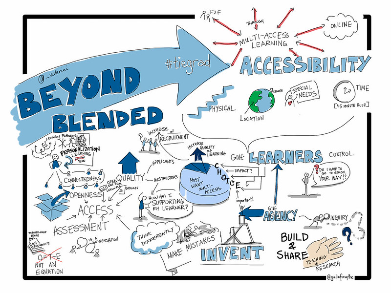

# Merging Modalities of Learning

### Topics {.unnumbered}

[This unit is divided into the following topics]{style="font-family:Wingdings"}:

5. Emerging Models of Open and Multi-Access Education
6. Multi-Access Learning Environments
7. Large Language Models and so-called "AI"

### Unit Learning Outcomes {.unnumbered}

When you have completed this unit, you should be able to:  

- Identify the ways institutional learning and teaching is changing.  
- Understand the difference between pedagogy and modality. 

### Learning Activities {.unnumbered}
Here is a list of learning activities that will benefit you in completing this unit. You may find it useful for planning your work.

<!-- **// todo #51** Add Learning Activities list  -->

### Assessment {.unnumbered} 

Please see the Assessment section in Moodle for assignment details.

### Resources {.unnumbered}

Online resources will be provided in the unit.
<!-- **// todo #50** Should we add the core book: Teaching in a Digital Age? -->

## Emerging Models of Open and Multi-Access Education

Online learning, blended learning, flipped classroom, face-to-face, hybrid course, multi-access... you may have heard some of these terms tossed around, especially recently with the shifting focus to online. Before we unpack and examine these modalities of learning, consider how learning in Higher Education has changed. *What are the shifts that have happened in the last 20, 10, 5 years? How has technology shaped the way teachers teach and the way students learn?*

### Activity {.unnumbered}

::: {.learning-activity}

After taking a moment to consider the questions above, read Chapter 1 of our core text, *Teaching in a Digital Age* by Tony Bates. It can be found by clicking on the following link:

***Note:*** *Particularly focus on sections 1.6-1.8.*

<!-- **// todo #47** Configure the following link to open in a new tab. -->

[Teaching in a Digital Age](https://pressbooks.bccampus.ca/teachinginadigitalagev3m/part/chapter-1-fundamental-change-in-education/){target="_blank"}

#### **Questions to Consider** {.unnumbered}

After completing the reading above, consider the following questions:

 - What changes have you seen in Online Learning?
 - What changes to you foresee in the next few years? 

:::

## Multi-Access Learning Environments

One trend that is gaining traction is **Multi-Access Learning.**

Read the following excerpt from *Realigning Higher Education for the 21st-Century Learner through Multi-Access Learning* by Irvine, Code & Richards (2013):

> Multi-access learning is an opportunity to meet both student needs for access to learning experiences and faculty needs for graduate student recruitment (Irvine, 2009; Irvine & Code, 2011, 2012; Irvine & Richards, 2013). Irvine defines multi-access learning as a *framework for enabling students in both face-to-face and online contexts to personalize learning experiences while engaging as a part of the same course.* Multi-access learning is different than blended learning because it places the **student at the center** of the learning experience as opposed to the instructor or the institution.

> Further, "blended learning" is a problematic term due to its multiple interpretations in the literature and in daily practice, leaving one to ask, "Who controls the blend?" When and where the face-to-face sessions occur and when and how the online synchronous or asynchronous sessions occur are often controlled in blended learning settings. At the core, the institution or instructor is in control of the blend, no matter the configuration.

> **Multi-access learning, however, has the learner at the center, with the ability to choose how he/she wants to access the course.** The core principle of the multi-access framework is one of enabling student choice in terms of the combination of course delivery methods through which the learning environment is accessed; that is, each individual learner decides how he/she wishes to take the course (e.g., face-to-face or online) and can then participate with other students and the instructor – each of whom have their own modality preferences – at the same time" (Irvine, Code & Richards, 2013).

*Source: Tiers of the multi-access framework (Irvine, Code & Richards, 2013).*

With the uncertainty brought on by COVID-19, multi-access learning has great potential for our education system. This modality not only brings more choice to students, but promotes a learner-centred course design and best practices in teaching and learning.

### The 4 tiers of multi-access learning:

##### Tier 1 {.unnumbered}

The first tier of multi-access learning is what most of you have experienced (as learners and faculty) as the predominant modality of higher education, face-to-face (f2f). F2f learning environments are often assumed to be the preferred modality of learning because a f2f classroom allows for rich, multi-modal interactions and robust community-building. This is true to an extent, but only if class sizes are very small; large, lecture-based classrooms present significant challenges to building the kind of critical and safe community for engaged interaction.

##### Tier 2 {.unnumbered}

The second tier of access allows learners who cannot travel to a central campus (like during a worldwide pandemic) to participate in a learning community syncronously via video conferencing. Remote and local learners may exchange items and artifacts and may share video feeds and use software such as Etherpad or screensharing through the web-conferencing tool to collaborate on documents for co-creation of content.

##### Tier 3 {.unnumbered}

The third tier provides asynchronous access for remote learners who cannot join the scheduled class session due to any number of constraints (employment, child/elder care, time-zone, or even network bandwidth). Irvine, et al. acknowledge that simply viewing a recording of a synchronous session, regardless of how collaborative and engaging that session may have been, is a much leaner experience for learners and may not be optimal. This highlights the need to provide learning materials in formats beyond video and audio, perhaps including text-based materials and asynchronous tools for co-creation of content such as GitHub.

##### Tier 4 {.unnumbered}

The outermost tier of the model is for open participation from non-credit learners who are choosing to participate for their own interest and edification. It may seem anathema to some faculty to consider opening their course to the world, but the benefits can be significant, particularly in times like the spring of 2020.

### Activity: Look, Read, and Reflect {.unnumbered}

::: {.learning-activity}

This Learning Activity begins by asking you to take a close look and consider the picture below this block.

<!-- **// todo #44** Include the image within the activity box. -->

#### Read {.unnumbered}

[Realigning Higher Education for the 21st-Century Learner through Multi-Access Learning](https://jolt.merlot.org/vol9no2/irvine_0613.htm)

#### **Questions to Consider** {.unnumbered}

After taking some time to consider the picture, along with completing the reading above, consider the following questions:

 - What ideas surround multi-access learning, according to the image?
 - What is your definition of multi-access learning?
 - If you were asked to provide multi-access learning for your course, what initial questions would you have?

:::

## Unit Summary {.unnumbered}
<!-- **// todo #48** -->

## Checking Your Learning {.unnumbered}
<!-- **// todo #49** -->

<!-- **// todo #45** Delete the following title? -->

<!-- ## Unit 4 Assessment {.unnumbered} -->

